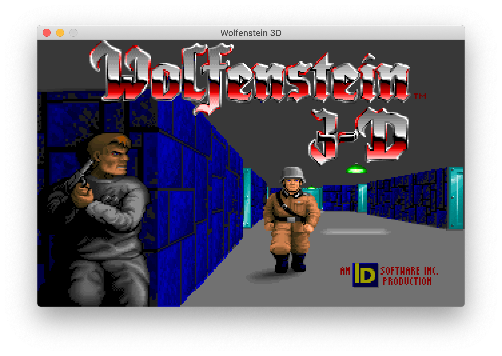
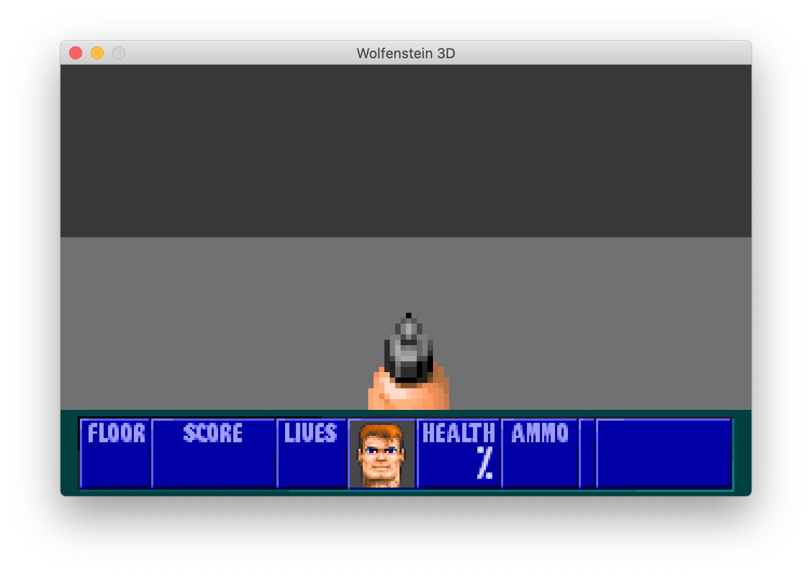

# wolf4py

Attempt at migrating [wolf4sdl](https://github.com/facundoolano/wolf4sdl) to Python.
This project is paused, but a similar port to Rust is being worked on [here](https://github.com/AdRoll/rustenstein).

    $ make deps
    $ cp ~/Path/to/Wolf/Data/*.wl6 data
    $ make run

